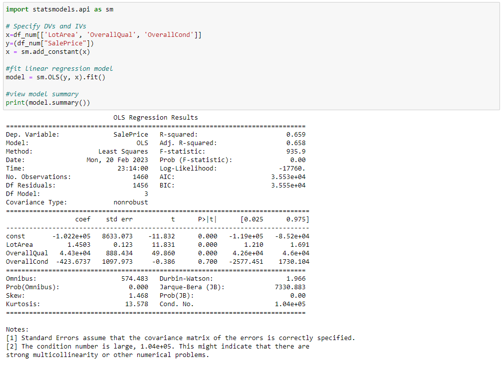
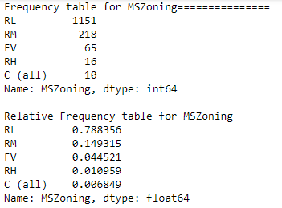
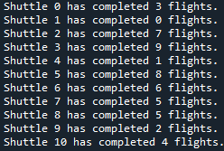
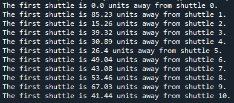
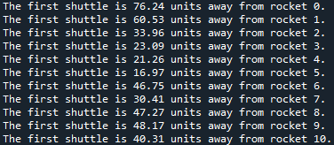

# homework 4 - Functions II

## Instructions

1.  Use Aimes housing prices data set from the `/data` folder. Variable descriptions can be found [here](https://www.kaggle.com/c/house-prices-advanced-regression-techniques/data)

2.  Your final document should be an `.ipynb` file. Include any other scripts you used to create the report in your HW submission.

In answering each of the questions for the assignment please include:

-   the question as a header in your Jupyter Notebook
-   the raw code that you used to generate any tables
-   the first and last five rows of the resulting data tables you're submitting as your answer

### Assignment items `[100 pts]`

1.  `[10 pts]` **Import the data as a pd.DataFrame object. Use one or more functions from the `pandas` library to split the data into three unique datasets. The first should include columns that are factors only (i.e., categorical data), the second should include columns that are numeric only, and the third should include columns with logical/boolean variables only.**

*Hint: Remember that data frames can be thought of as a collection of lists/arrays/pd.Series objects saved in different columns. So think of each column in your data-frame as a pd.Series and split based on column type. Note that pandas has a dtype called "object", which it uses when it cannot determine the datatype. Generally, pandas will save string variables as object data types. For this question, treat object data types as a categorical factor.*

2.  `[10 pts]` **Using the second dataset from question #1, for each numeric variable use the apply function from the `pandas` library to return the mean, median and standard deviation (SD) of all numeric variables.**

3.  `[10 pts]`**Using the second dataset from question #1, create a new dataset that only includes the variable indicating sales price ("SalePrice"). Search for a categorical variable which has between 2-4 categories in the full dataset that you think may be related to the sales price of houses. Give the mean, median and SD for SalePrice based on the different groups of the categorical variables. Does the average price seem to vary by the different levels of the categorical factor you chose?**

4.  `[5 pts]` **Regress "SalePrice" on "LotArea", "OverallQual", "OverallCond" with the `statsmodels` library. Use the syntax below to replicate the output shown you are able to estimate this regression model.**

5.  `[10 pts]` **Write a for loop that loops through each level of the categorical factor you chose in Q3, where each iteration of the for loop subsets your data for one group of the categorical variable at a time, and then fits the same regression model specified above in Q4 k times, where k refers to the number of unique categories. On each iteration of your for loop, store the `model.summary()` information as a new element in a list object. Once your for loop is done running, print the list. There should be k regressions which you estimated. Does the effect of LotArea on SalePrice vary within the different levels of the categorical factor you chose? What is another, more common way to answer a question like this (i.e., a question about moderation or effect heterogeneity)?** *Hint: Don't forget to account for the standard error when comparing the regression slopes!*

    

6.  `[15 pts]` **Using the first dataset from question #1, for each categorical variable use a for loop to print a frequency and relative frequency table for every variable. To make your output readable, for each variable you should print the following in this order, placing the variable name where you see blanks below.**

    -   "Frequency table for \_\_\_\_\_\_ ============"

    -   Display the frequency table

    -   Skip a line, and print "Relative frequency table for \_\_\_\_\_\_ ============"

    -   Skip two lines before printing the data for the next categorical variable

        This is what your output should look like for the MSZoning variable.

    For example, for the MSZonig variable your output should look like this:

    

7.  `[10 pts]` **Do the same thing as number 6, but with a while loop this time.**

8.  `[15 pts]` **Using the `Rocket` class which we created as part of the week 7 class activity, we are going to create a new class called `shuttle`. The shuttle class should inherit all of Rocket's characteristics but has one additional parameter: *flights_completed* which measures the number of flights the shuttle has completed.**

Define the shuttle class as the child of the rocket class (please define it in the same jupyter notebook which has all of your other HW answers), and then initialize a new instance of your shuttle class. Once you've created a Shuttle, print the following message: "The shuttle is located at (\_\_, \_\_), and has recorded \_\_ flights", filling the blank spaces to reflect the information for the Shuttle you just created.

9.  `[15 pts]` **Write a single for loop which randomly creates 11 rockets and 11 shuttles using randomly generated integers. Store this output in two separate lists. Once you have your data, use for loops to print the messages you see below. Note you can use the `randint()` function from the `random` module (which you can import with the command `from random import randint`) to randomly generate the characteristics of your Rockets and Shuttles.**

For the shuttles you created, loop through them and print the following messages in your jupyter notebook (*Hint: use the enumerate function in your for loop!*)

For the shuttles you created, print out the following output using a for loop.

Because the rocket class is a parent of the shuttle class, we can compare them since they share some of the same properties. Print the output below using a for loop.

